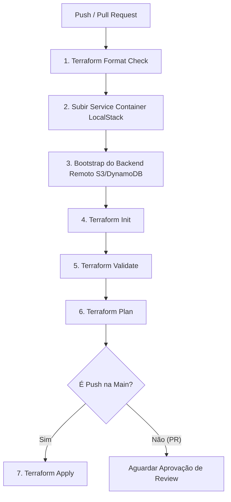

# ☁️ local-cloud-sec-lab


Laboratório prático de **Infraestrutura como Código (IaC)** com **Terraform**, **LocalStack** e **GitHub Actions**. Este projeto implementa uma esteira automatizada de CI/CD alinhada às melhores práticas de **Shift-Left**, segurança cibernética e governança em ambientes de nuvem emulados.

---

## 📌 Arquitetura e Estrutura do Repositório

O projeto é dividido de forma modular para garantir a separação de responsabilidades e o gerenciamento isolado do estado remoto (*remote state locking*):

```text
local-cloud-sec-lab/
├── .github/
│   └── workflows/
│       └── terraform.yml       # Esteira de CI/CD (Lint, Validate, Plan e Apply)
├── 01-bootstrap/
│   └── main.tf                 # Provisionamento do Bucket S3 e Tabela DynamoDB para o TF State
├── 02-app/
│   └── main.tf                 # Recursos da aplicação (VPC, Subnets, Internet Gateway, Tags)
├── .gitignore                  # Arquivos ignorados pelo controle de versão
└── README.md                   # Documentação do laboratório
```

---

## 🛠️ Tecnologias e Ferramentas

| Tecnologia | Descrição | Uso no Projeto |
| :--- | :--- | :--- |
| **[Terraform](https://www.terraform.io/)** | Ferramenta de IaC declarativa | Provisionamento e gerenciamento de recursos |
| **[LocalStack](https://localstack.cloud/)** | Emulador local de serviços AWS | Testes locais de S3, DynamoDB, EC2 e IAM |
| **[GitHub Actions](https://github.com/features/actions)** | Plataforma de automação e CI/CD | Execução do pipeline em Pull Requests e Pushes |
| **[AWS CLI](https://aws.amazon.com/cli/)** | Interface de linha de comando da AWS | Interação direta e validação dos recursos no LocalStack |
| **PowerShell** | Shell de comandos do Windows | Execução e automação dos scripts locais |

---

## 🔄 Esteira de CI/CD (GitHub Actions & Shift-Left)

A pipeline automatizada garante que todo código de infraestrutura seja auditado antes de chegar em produção:



### Detalhamento das Etapas:
1. **Terraform Format Check:** Executa `terraform fmt -check -recursive` para bloquear códigos fora do padrão de formatação.
2. **Ambiente Emulado:** Sobe a imagem do LocalStack (`v3.8.0`) como serviço do GitHub Actions.
3. **Provisionamento do State Storage:** Cria a infraestrutura base (bucket S3 e tabela DynamoDB) necessária para gerenciar os arquivos de estado `.tfstate`.
4. **Validação Estática:** Garante a sintaxe dos arquivos declarativos através de `terraform validate`.
5. **Planejamento de Mudanças:** Executa `terraform plan` nos Pull Requests para exibir o impacto da alteração.
6. **Deploy Automatizado:** Executa `terraform apply -auto-approve` exclusivamente após a aprovação e *merge* na branch `main`.

---

## 🚀 Guia Prático de Execução Local

Siga este passo a passo no seu ambiente de desenvolvimento (PowerShell no Windows):

### Pré-requisitos
- **Docker Desktop** instalado e em execução.
- **Terraform v1.x+** instalado.
- **AWS CLI v2** instalado.
- **Git** instalado.

---

### 1. Iniciar o Container do LocalStack
Execute o container Docker expondo a porta `4566`:

```powershell
docker run -d `
  --name localstack `
  -p 4566:4566 `
  -e SERVICES=s3,dynamodb,ec2,iam,sts `
  localstack/localstack:3.8.0
```

---

### 2. Configurar Variáveis de Ambiente
Defina as credenciais fictícias no PowerShell para apontar as chamadas para o LocalStack:

```powershell
$env:AWS_ACCESS_KEY_ID="test"
$env:AWS_SECRET_ACCESS_KEY="test"
$env:AWS_DEFAULT_REGION="us-east-1"
```

---

### 3. Provisionar o Storage do Remote State (01-bootstrap)
Crie o bucket S3 e a tabela DynamoDB para armazenar o estado localmente:

```powershell
# Criar Bucket S3 para guardar o tfstate
aws --endpoint-url=http://localhost:4566 s3 mb s3://meu-bucket-tfstate-local

# Criar Tabela DynamoDB para o State Locking
aws --endpoint-url=http://localhost:4566 dynamodb create-table `
  --table-name meu-lock-table-local `
  --attribute-definitions AttributeName=LockID,AttributeType=S `
  --key-schema AttributeName=LockID,KeyType=HASH `
  --billing-mode PAY_PER_REQUEST
```

---

### 4. Deploy da Aplicação (02-app)
Acesse a pasta `02-app`, formate o código, inicialize os módulos e aplique a infraestrutura:

```powershell
# Entrar no diretório do módulo
cd 02-app

# Formatar arquivos de configuração
terraform fmt

# Inicializar o backend remoto
terraform init

# Gerar e visualizar o plano de execução
terraform plan

# Aplicar o provisionamento dos recursos
terraform apply -auto-approve
```

---

### 5. Validação dos Recursos no LocalStack
Verifique se a VPC e as tags de governança foram aplicadas com sucesso:

```powershell
# Listar Buckets S3
aws --endpoint-url=http://localhost:4566 s3 ls

# Inspecionar VPCs criadas e suas respectivas Tags
aws --endpoint-url=http://localhost:4566 ec2 describe-vpcs --query "Vpcs[*].{VpcId:VpcId,CidrBlock: